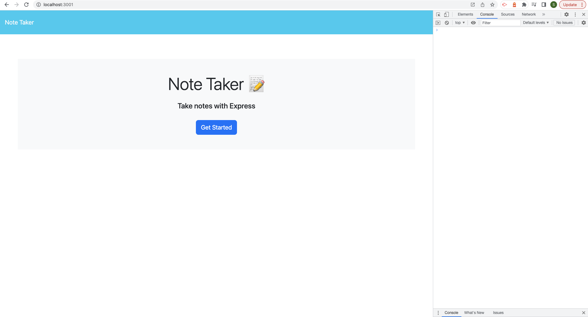
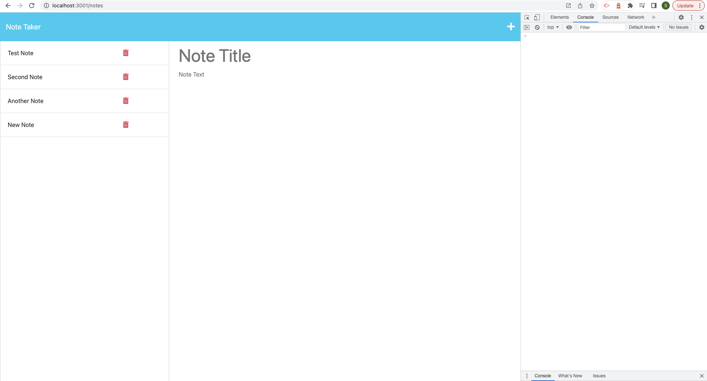
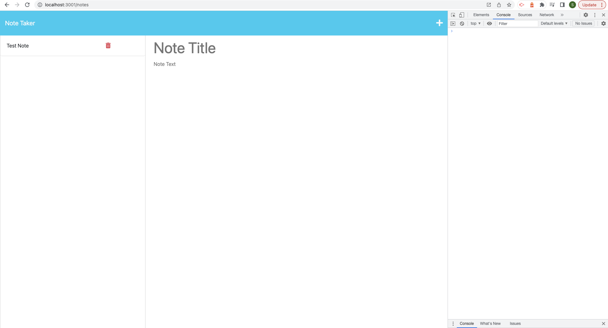

# Note-Taking-Express

 ## Description

Note-Taking-Express is made using express and node. It allows one to store their notes online rather than only locally. It allows one to create and delete notes.

  ## Table of Contents
  - [Usage](#Usage)
  - [Credits](#Credits)
  - [License](#License)
  - [Features](#Features)
  - [Contribution](#Contribution)
  - [Questions](#Questions)

## Usage
  * Run 'npm i' in your terminal to install relavent packages.
  * Run 'node server.js' to connect to server.

  - Here is a screenshot of the loaded application start page:

  

  - Here is a screenshot of the notes page with old notes:

  

- Here is a screenshot of the app with a newly added note:

  

- Here is a screenshot of the app with some deleted notes:

  

  ## Credits
    * https://github.com/Sal8298
    * https://github.com/its-jefe/Note-Taker
    * Garrett Winter [https://github.com/garrettWinter]

  ## License
  * MIT

  ## Features
  * User can create and delete notes.
  * Data can survive a page reload as it is stored in a json file.
  * Clicking the plus symbol in top right corner clears the text area.

  ## Contribution
  * To contribute you may reach me via email at sal@email.com.

  ## Questions
  [Link to my Github profile](https://github.com/Sal8298)
  Any Questions? If so, you can reach out to me at sal@email.com.